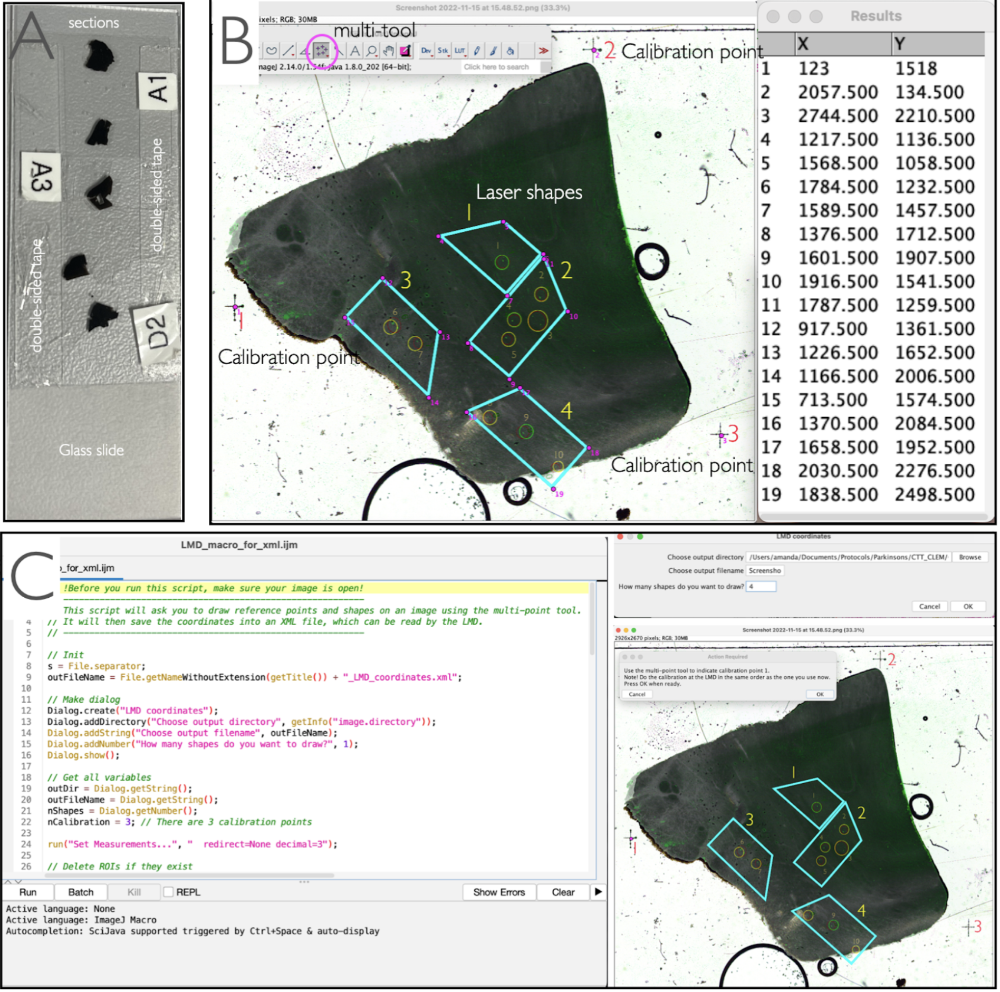

# CLEM-for-human-brain

## Goals
1. In a 2D image of a tissue section, draw shapes around ROIs to be cut by a Leica Laser-microdissector (LMD);
2. Output an XML file which can be imported into the LMD software, to facilitate laser microdissection.

These goals are implemented in the FIJI macro ```LMD_coordinates.ijm```.

## Requirements
- [FIJI (version 1.53d or later)](https://imagej.net/software/fiji/downloads)
- [Leica laser microdissector](https://www.leica-microsystems.com/products/light-microscopes/p/leica-lmd7/) and corresponding LMD software.

## Detailed procedure
1. Process tissue slices for correlative light and electron microscopy according to your favourite CLEM protocol. 
2. Peel the embedded sections off the Aclar sheet and mount on a glass slide using double sided tape
3. Load glass slide into the slide holder of a brightfield microscope. Make 3 calibration crosses with laser into the resin surrounding the section (top left, top right, bottom right) using the 4X objective.
4. Take a brightfield image of the section at a magnification suitable to visualize the calibration marks.
5. Overlay this image with the fluorescent map and annotate the areas to be laser cut.
6. Export the image of the section with the drawn shapes and open it in FIJI.
7. Open the macro ```LMD_coordinates.ijm``` in FIJI by dragging and dropping it into the Fiji bar
8. Click 'run'. 
9. Follow the series of pop-ups asking you to set some parameters, mark the calibration points, and mark the corners of the shapes (see figure below).
10. An XML will be saved in the directory indicated at the start.
11. Import the .xml file into the microscope software. 
12. Follow the prompts for sample calibration.
13. Check that all shapes have been imported and are in the correct position.
14. Start laser cutting 




## Expected XML output file
Expected XML coordinate file with 3 calibration points and 3 ROIs:
```xml
<ImageData>
<GlobalCoordinates>1</GlobalCoordinates>
<X_CalibrationPoint_1>3496</X_CalibrationPoint_1>
<Y_CalibrationPoint_1>3573</Y_CalibrationPoint_1>
<X_CalibrationPoint_2>6100</X_CalibrationPoint_2>
<Y_CalibrationPoint_2>3534</Y_CalibrationPoint_2>
<X_CalibrationPoint_3>6497</X_CalibrationPoint_3>
<Y_CalibrationPoint_3>6184</Y_CalibrationPoint_3>
<ShapeCount>3</ShapeCount>
<Shape_1>
<PointCount>5</PointCount>
<TransferID>ROI1</TransferID>
<CapID>A1</CapID>
<X_1>5207</X_1>
<Y_1>4048</Y_1>
<X_2>5206</X_2>
<Y_2>4213</Y_2>
<X_3>5443</X_3>
<Y_3>4379</Y_3>
<X_4>5672</X_4>
<Y_4>4380</Y_4>
<X_5>5673</X_5>
<Y_5>4050</Y_5>
</Shape_1>
<Shape_2>
<PointCount>5</PointCount>
<TransferID>ROI2</TransferID>
<CapID>A1</CapID>
<X_1>5691</X_1>
<Y_1>4580</Y_1>
<X_2>5319</X_2>
<Y_2>4300</Y_2>
<X_3>5160</X_3>
<Y_3>4510</Y_3>
<X_4>5295</X_4>
<Y_4>4697</Y_4>
<X_5>5492</X_5>
<Y_5>4844</Y_5>
</Shape_2>
<Shape_3>
<PointCount>4</PointCount>
<TransferID>ROI3</TransferID>
<CapID>A1</CapID>
<X_1>5135</X_1>
<Y_1>5122</Y_1>
<X_2>4710</X_2>
<Y_2>5309</Y_2>
<X_3>5061</X_3>
<Y_3>5517</Y_3>
<X_4>5268</X_4>
<Y_4>5425</Y_4>
</Shape_3>
</ImageData>
```
